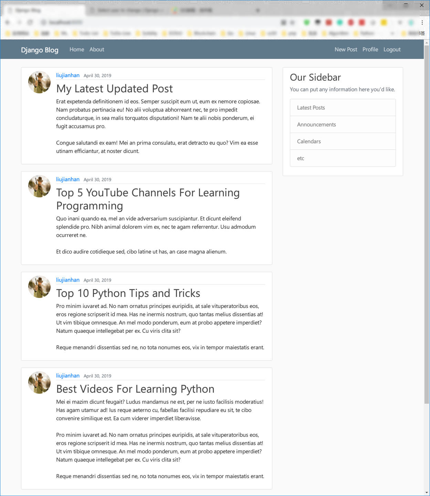

## Django_Blog
---
## Finally

---
### 踩坑备忘录
#### 1.发送邮件设置
    - 邮件发送设置
    EMAIL_BACKEND = 'django.core.mail.backends.smtp.EmailBackend'
    EMAIL_HOST = 'smtp.163.com'
    EMAIL_PORT = 465
    # EMAIL_USE_TLS = True
    EMAIL_USE_SSL = True
    EMAIL_HOST_USER = 'lorgerd@163.com'
    EMAIL_HOST_PASSWORD = '*****'
    # 教程未涉及以下设置，django邮件无法发送
    # 找回密码的邮箱必须是已经注册过的邮箱
    DEFAULT_FROM_EMAIL = 'lorgerd@163.com'